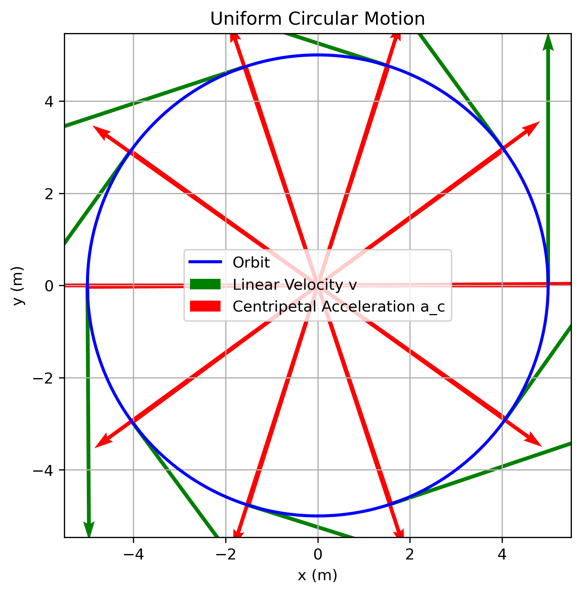
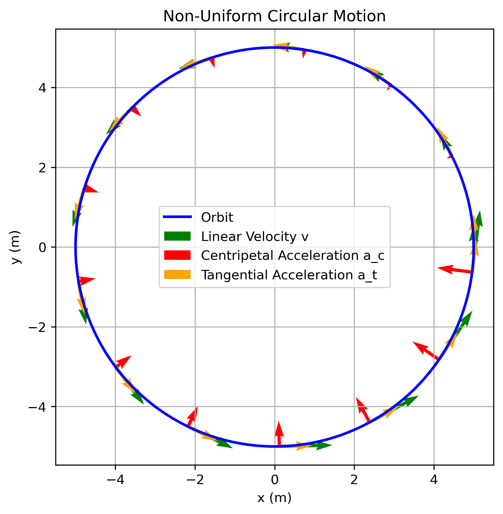
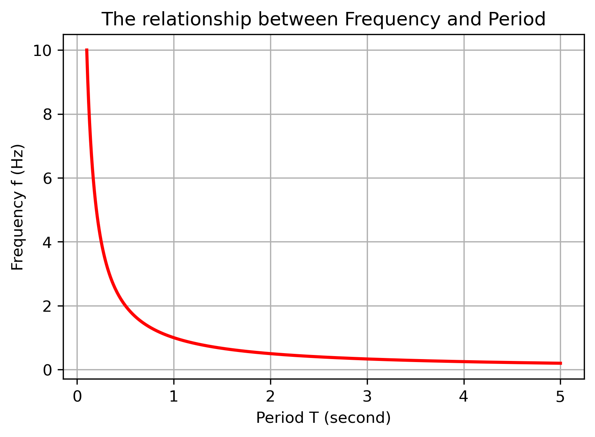

# Circular Motion: Theory, Simulation, and Visualization

## Overview

This project presents a theoretical and computational study of circular motion, one of the fundamental topics in classical mechanics. It combines analytical formulations with Python-based simulations to better understand how physical quantities evolve over time.

The project focuses on both **uniform** and **non-uniform circular motion**, supported by graphical visualizations.

## Objectives

* To understand the physics of circular motion
* To implement basic simulations using Python
* To visualize motion and key relationships
* To connect theoretical equations with graphical results

## Theoretical Background

### Uniform Circular Motion

In uniform circular motion, an object moves along a circular path with constant speed. However, its velocity direction continuously changes, resulting in centripetal acceleration.

Key equations:

* v = 2πr / T
* ω = 2π / T
* v = ωr
* a = v² / r
* F = m v² / r

### Non-Uniform Circular Motion

In non-uniform circular motion, both the magnitude and direction of velocity change.

Acceleration consists of two components:

* **Centripetal acceleration** (toward the center)
* **Tangential acceleration** (changes speed)

The total acceleration is the vector sum of these components.

## Computational Approach

This project uses Python to simulate circular motion and visualize its behavior.

### Tools

* NumPy — numerical calculations
* Matplotlib — visualization

## Visualizations and Results

### 1. Uniform Circular Motion



This visualization represents motion with constant angular velocity.
Although the speed remains constant, the direction of velocity changes continuously, resulting in centripetal acceleration toward the center.

### 2. Non-Uniform Circular Motion



This graph represents motion where angular velocity changes over time.
Both centripetal and tangential acceleration components are present, causing changes in both direction and magnitude of velocity.

### 3. Frequency–Period Relationship



This graph demonstrates the inverse relationship between frequency and period:

T = 1 / f

As frequency increases, the period decreases, confirming the theoretical relationship.

## Key Insights

* Circular motion always involves acceleration due to direction change
* Uniform motion has constant speed but non-zero acceleration
* Non-uniform motion includes both speed and direction changes
* Graphical visualization helps better understand physical behavior

## Applications

* Orbital motion and astrophysics
* Rotational systems in engineering
* Vehicle dynamics
* Physical simulations

## Articles

This project is supported by detailed written explanations available in both English and Turkish.

* English version: `articles/Circular Motion.eng.pdf`
* Turkish version: `articles/Circular Motiong.tr.pdf`

These articles provide a more detailed explanation of circular motion, including theoretical background and real-world examples.

## Project Structure

```
CircularMotion/
│── README.md
│── scripts/
│── results/
│── articles/
```

## Future Improvements

* Extending simulations using differential equations
* Adding more detailed physical models
* Creating animated visualizations
* Expanding to 3D motion


## Author

Azra Aleyna Bozkurt
Physics Applicant — Computational Physics Focus

## Conclusion

This project reflects a combined approach to learning physics through theory and computation. By integrating analytical understanding with numerical visualization, it aims to provide a clearer and more intuitive understanding of circular motion.
